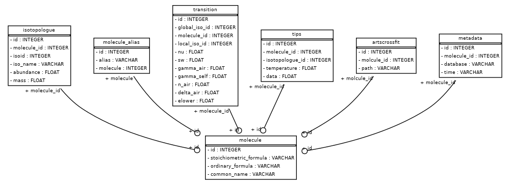

Spectral Inputs
---------------

This package aims to provide a :code:`python` interface to line-by-line calculations of
absorption coefficients that is “traceable to benchmarks”.  The overall goal is to treat
lines, cross-sections, continua, collision-induced absorption, and line mixing. The package
is structured so that the user can have multiple back-ends to choose from when running the
calculation (see the API section of this documentation).  Spectral input data is downloaded
from the web and stored in a local :code:`sqlite3` database, which we expect the users to
build (or rebuild) before running any calculations using a simple API consisting of
a :code:`Database` and :code:`HitranWebApi` object.

Creating the local spectral database
~~~~~~~~~~~~~~~~~~~~~~~~~~~~~~~~~~~~

To create the spectral database, start by creating :code:`HitranWebApi`
and :code:`Database` objects:

.. code-block:: python

  from pyLBL import Database, HitranWebApi
  webapi = HitranWebApi("<your HITRAN API key>")  # Prepare connection to the data sources.
  database = Database("<path to database>")  # Make a connection to the database.
  database.create(webapi)  # Note that this step will take some time.

Line data will be downloaded from HITRAN_.  Your HITRAN API key is a unique string provided
to each account holder by the HITRAN_ website.  You must make an account there.  In order
to get your api key, create an account, log in, click on the little person icon near the
top right part of the screen to get to your profile page (or navigate to profle_) and copy
the long string listed as your "API Key".  Note that keeping track of which version of
the HITRAN data that is being downloaded is still currenlty under development.

For treatment of molecular continua, we use a python port of MT-CKD developed by AER.
Currently, the python port is based on version 3.5 and reads data from an automatically
downloaded netCDF dataset.  This dataset includes the effects of collision-induced
absorption.  In the near future it is expected that this data will be
incorporated into the HITRAN database and once it is this package will be updated to
instead download it from there.

For treatment of cross-sections (polynomial interpolation in temperature and/or pressure),
we use a model_ developed at the University of Hamburg (UHH). This model provides data in
netCDF datasets, which are downloaded automatically.

Downloading the data and creating the database only needs to be done at least once,
can take a significant amount of time (~30 minutes).

Re-using an existing spectral database
~~~~~~~~~~~~~~~~~~~~~~~~~~~~~~~~~~~~~~

Once a local spectral database is created, it can be re-used by simply connecting to it:

.. code-block:: python

  from pyLBL import Database
  database = Database("<path to database>")

Since the database already exists and is populated, there is no longer a need to create
a :code:`HitranWebApi` object.

Defining the spectral grid
~~~~~~~~~~~~~~~~~~~~~~~~~~

Spectral grid input should in wavenumber [cm-1] and be defined as a numpy
array, for example:

.. code-block:: python

  from numpy import arange
  grid = arange(1., 5001., 0.1)

Also as of now, the wavenumber grid resolution should be one divided by an integer.  This
requirement may be relaxed in the future.

Spectral database schema
~~~~~~~~~~~~~~~~~~~~~~~~

The local spectral database uses :code:`sqlite3` and consists of a series of tables.

The :code:`molecule` table stores all the unique molecules found in the HITRAN database.
It links to all of the other tables through each molecules's unique :code:`id`.
In order to improve accessibility, each molecule can have associated string aliases which are
stored in the :code:`molecule_alias` table.  For example, "H2O", "water vapor", etc. are
all aliases for H2O, and can be used to find H2O in the database. Each molecule may have
many different forms known as istolopologues.  These isotopologues are stored in
the :code:`isotopologue` table, and have their own ids, names, masses, and abundance amounts.
Each isotopologue contains many molecular lines, or transitions between quantum states.  The
properties of these transitions are downloaded from HITRAN and stored in
the :code:`transition` table.  Furthermore, each isotopologue has a table of total
internal partition functions values at various temperatures which are stored in
the :code:`tips` table.  For some molecules, explicit molecular lines are not treated directly,
but absorption cross-sections are instead calculted using polynomial interpolation in
temperature and/or pressure).  Paths to the datasets that store these cross-section tables
are stored in :code:`artscrossfit` table.

.. _HITRAN: https://hitran.org
.. _model: https://doi.org/10.1002/essoar.10511615.1
.. _profile: https://hitran.org/profile
